# AI Text Summarizer


## Overview

A production-ready AI application that transforms lengthy documents (500+ words) into concise three-bullet-point summaries using Facebook's BART-large-cnn model from HuggingFace Transformers.

## Features

- **Intelligent Summarization**: Uses state-of-the-art NLP model for high-quality summaries
- **Clean Interface**: Streamlit-powered responsive UI
- **Input Validation**: Ensures minimum 500-word requirement
- **Performance Optimized**: Automatic GPU detection (CUDA support)
- **Properly Formatted Output**: Always returns exactly 3 bullet points
- **Comprehensive Testing**: Most test coverage

## Tech Stack


- **Frontend**: Streamlit
- **Backend**: Python 3.9+
- **NLP Model**: facebook/bart-large-cnn
- **Testing**: pytest

## Installation

### Prerequisites

- Python 3.9+
- pip package manager
- (Optional) NVIDIA GPU with CUDA for faster inference

### Installation
```bash
git clone https://github.com/mohvam98/ai-text-summarizer.git
cd ai-text-summarizer
python -m venv venv
source venv/bin/activate  # Linux/Mac
.\venv\Scripts\activate  # Windows
pip install -r requirements.txt
```

### Usage
1. Run the application:
```bash
streamlit run app.py
```
2. Open your browser to http://localhost:8501
3. Paste your text (minimum 500 words) and click "Summarize"
## 🏗️ Architecture

### System Flow

```mermaid
graph TD
    A[User] --> B[Streamlit UI]
    B --> C{Word Count ≥500?}
    C -->|Yes| D[BART Model]
    C -->|No| E[Show Warning]
    D --> F[3-Bullet Processing]
    F --> G[Display Summary]
```


### Project Structure
```bash
ai-text-summarizer/
├── app.py                # Main application
├── summarizer.py         # Summarization logic
├── test_summarizer.py    # Unit tests
├── requirements.txt      # Dependencies
├── LICENSE               # MIT License
└── README.md             # This file
```

### Testing
Run the test suite with:

```bash
pytest test_summarizer.py -v
```
Generate coverage report:

```bash
pytest --cov=summarizer test_summarizer.py
```
